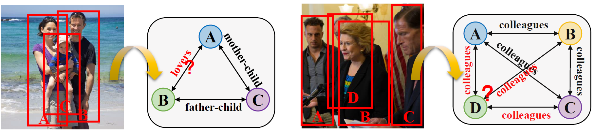

# GR2N

PyTorch implementation of Graph-Based Social Relation Reasoning  (ECCV 2020)  \[[arXiv](https://arxiv.org/abs/2007.07453)\]\[[ECVA](http://www.ecva.net/papers/eccv_2020/papers_ECCV/html/2287_ECCV_2020_paper.php)\]\[[Video](https://www.youtube.com/watch?v=zCTPRxxlZsI&t=427s)\]
<p align="center">
  
</p>


If you find our work useful in your research, please consider citing:
```
@inproceedings{li2020graph,
  title={Graph-Based Social Relation Reasoning},
  author={Li, Wanhua and Duan, Yueqi and Lu, Jiwen and Feng, Jianjiang and Zhou, Jie},
  booktitle={ECCV},
  year={2020}
}
```


